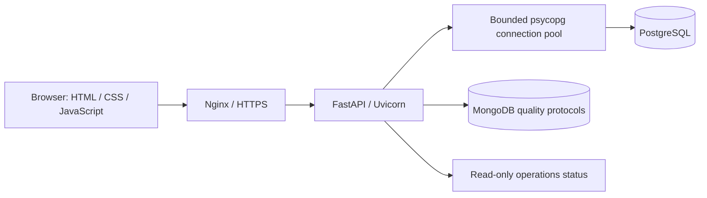

# Manufacturing Lab

**From a management question to the order, component or document behind it.**

A personal manufacturing analytics demo by **Grigory Shmykov**, built with AI assistance and informed by hands-on experience in manufacturing, procurement, sales and enterprise IT. It connects sales, order fulfillment, BOM shortages, claims and project milestones in one browser interface. All business records are synthetic.

**Portfolio focus:** technical project management, business-systems integration and manufacturing process improvement. I initiated the project, defined its business meaning and directed iterative delivery from management questions to a working application.

[Open the live demo](https://83.147.192.229/#sales) · [Two-minute walkthrough](docs/PORTFOLIO.md) · [Русская документация](README.ru.md)

## What to explore

| Business question | Demonstrated workflow |
|---|---|
| Are orders turning into shipments and cash? | Separate order, shipment and payment measures; compare periods and open the underlying records. |
| What is preventing an order from shipping? | Follow an order to its items, BOM, component shortages and expected supply. |
| What happened after delivery? | Connect claims and returned items to the original order without rewriting the shipment history. |
| Is a complex order progressing? | Review weighted milestones, dependencies, acceptance criteria and a Kanban view. |
| Can the supporting system be operated and checked? | Inspect application/database health, recorded backup and restore checks, change history and sample quality protocols. |

The interface supports **English, Russian and Hebrew**, including right-to-left layout, themes, drill-down navigation and CSV export.

## My role

I originated the project and defined the business scenarios, metrics, screen structure, priorities and acceptance criteria. I accepted results against manufacturing workflows and required corrections, including the distinction between an order, its shipments, payment and a later return. AI tools produced code and assisted with technical implementation and deployment under my direction.

## Copyright and reuse

**Copyright (c) 2026 Grigory Shmykov. All rights reserved.** Shared for recruitment and professional evaluation only, including AI-assisted review under the license conditions. Copying, running, modification, redistribution and reuse require prior written permission, subject to the limited evaluation and platform/legal exceptions in [LICENSE.md](LICENSE.md). No permission is granted for model training. This is not an open-source project.

## Architecture



- **Data:** PostgreSQL reporting queries, BOM and order relationships; a read-only application role and consistent report snapshots. Optional MongoDB integration provides sample quality documents.
- **Application:** Python, FastAPI, Pydantic, psycopg and OpenAPI. Database handlers use synchronous connections in worker threads.
- **Delivery:** Docker Compose, GitHub Actions checks and an optional deployment job with a health check and application-image rollback. The demo uses Nginx and Let's Encrypt HTTPS.
- **Operations:** backup and restore exercises, audit events and a read-only status view. These demonstrate operating procedures on one demo server, not a redundant production service.

## Run locally

Requirements: Docker with Compose and OpenSSL. From the repository root:

```sh
sh deploy/prepare-env.sh .env
docker compose up -d --build
```

The setup script generates local passwords on the first run and preserves an existing `.env`. Do not commit that file. An existing database volume keeps its data and credentials.

- [Application](http://localhost:8765/)
- [API documentation](http://localhost:8765/docs)
- [OpenAPI schema](http://localhost:8765/openapi.json)

Choose **September 2026** in the interface to explore the sample data; August is available for comparison. Other months have no seeded business activity. Operational integrations need additional setup described below.

## Verification and implementation details

| Area | Evidence in the repository |
|---|---|
| API contracts, database pool and failure handling | [API tests](tests/test_api.py), [database access](database.py) |
| Reporting and order relationships | [SQL queries](queries/), [schema and seed data](db/init.sql) |
| Claims, periods, navigation and projects | [Tests](tests/), [frontend](dist/) |
| CI checks and deployment boundary | [Workflow](.github/workflows/ci-cd.yml), [CI/CD runbook](deploy/CI-CD.md) |
| Backups, restore checks and audit evidence | [Operations runbook](deploy/OPERATIONS.md), [operations API](operations.py) |

With the local database running, `sh deploy/test.sh` runs the documented container-based checks. CI also checks JavaScript and the container build. This README describes the checks provided; it does not claim that every environment or deployment is continuously verified.

## Scope

This is an analytics and operations laboratory. Inventory uses a fixed teaching snapshot; it is not a complete stock-movement ledger or MRP system. Claims do not create accounting entries, and project milestones are read-only. Business scenarios and the sample quality certificate are fictional. The public demo has no production user/approval workflow, customer deployment or measured business savings. Backup copies currently remain on the same server; external backup export is disabled.

## Documentation

- [Portfolio walkthrough and design decisions](docs/PORTFOLIO.md)
- [Full setup and feature documentation, in Russian](README.ru.md)
- [Data model and exercises, in Russian](docs/training-notes.md)
- [Deployment](deploy/README.md) · [CI/CD](deploy/CI-CD.md) · [Operations](deploy/OPERATIONS.md)

**Contact:** [Grigory Shmykov on LinkedIn](https://www.linkedin.com/in/grigory-shmykov-63b11016b/)
