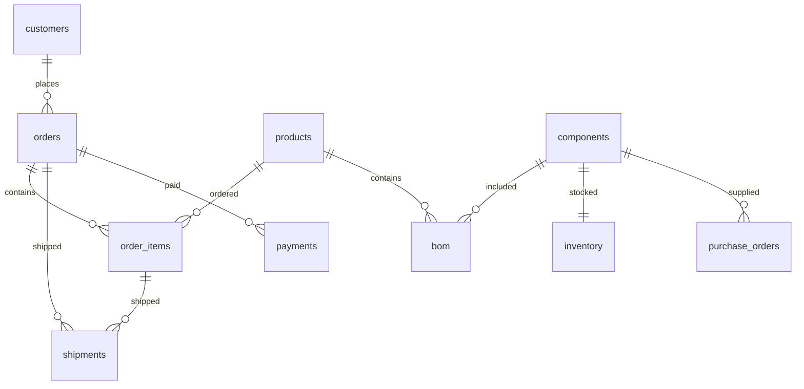

# Цех — учебный стенд PostgreSQL и дашбордов

Локальный проект для подготовки к роли IT & Data Infrastructure Lead. Все данные синтетические; это не данные Mechanical Devices. После первого скачивания образов работает без интернета. Библиотеки и шрифты с внешних CDN не используются.

## Открыть

[Дашборды](http://127.0.0.1:8765/) · [Заказы](http://127.0.0.1:8765/#orders) · [Комплектующие](http://127.0.0.1:8765/#supply)

По умолчанию отчёт показывает состояние на 12 сентября 2026 года включительно. Можно выбрать любую дату сентября. Кнопка обновления перечитывает PostgreSQL; изменения данных через SQL видны после обновления.

Четыре экрана:

1. **Продажи:** заказано, отгружено, оплачено, остаток оплаты, накопительная динамика, учебный план отгрузок и каналы продаж.
2. **Исполнение заказов:** сроки, частичные отгрузки, фильтр статусов, карточка заказа, первоначальный и перенесённый срок.
3. **Комплектующие:** BOM, доступные остатки, резервы, дефицит, затронутые заказы и открытые поставки.
4. **Сервер и БД:** реальные показатели приложения и PostgreSQL.

Внизу каждого экрана — «Посмотреть SQL» с серверными запросами. SQL не исполняется из браузера: приложение выполняет заранее определённые запросы с параметром даты.

## Запуск и остановка

Из этой папки:

```sh
sh deploy/prepare-env.sh .env && docker compose up -d --build
docker compose ps
docker compose stop
docker compose start
```

Данные сохраняются в отдельном Docker volume `manufacturing-training_lab_data`. Обычные stop/start и пересборка приложения их не удаляют. Скрипт `db/init.sql` выполняется только при первом запуске на пустом томе. Изменение этого файла не меняет уже созданную базу.

## Подключение к PostgreSQL

| Параметр | Значение |
|---|---|
| Host | `127.0.0.1` |
| Port | `55432` |
| Database | `manufacturing_lab` |
| Учебный пользователь | `lab` |
| Пароль | `POSTGRES_PASSWORD` из локального `.env` |

Пароли хранятся в локальном `.env`, исключённом из Git. Порты опубликованы только на loopback. Пользователь `lab` управляет учебной базой; приложение подключается отдельным пользователем `dashboard` с правами только SELECT и режимом read-only.

Открыть SQL-консоль без установки psql на Mac:

```sh
docker compose exec db psql -U lab -d manufacturing_lab
```

Полезные команды внутри psql:

```sql
\dt
\d orders
SELECT * FROM orders ORDER BY order_id;
\q
```

## Структура данных

| Таблица | Строк | Одна строка означает |
|---|---:|---|
| customers | 12 | Клиент |
| products | 12 | Модель изделия |
| orders | 27 | Заголовок заказа: клиент, дата, срок, статус |
| order_items | 32 | Позиция заказа: изделие, количество, цена |
| shipments | 31 | Частичная или полная отгрузка позиции заказа |
| payments | 31 | Платёж или отрицательная операция возврата |
| components | 12 | Компонент |
| bom | 15 | Количество компонента на единицу изделия |
| inventory | 12 | Остаток и внешний резерв компонента |
| purchase_orders | 12 | Открытая поставка компонента |

Всего 196 строк с августовской историей и многопозиционными примерами. Основные связи:



## Правила и упрощения

- Заказ содержит одну или несколько позиций; количество и цена зафиксированы в order_items. Все суммы в шекелях, НДС и курсы валют не моделируются.
- Отгрузки агрегируются сначала по order_item_id с ценой позиции, позиции — по order_id; оплаты агрегируются отдельно по order_id, затем соединяются с итогом заказа. Так JOIN не умножает суммы.
- Дата — конец выбранного дня. Отгрузки и оплаты после неё не учитываются. Открытая просрочка начинается на следующий день после due_date.
- Процент исполнения в срок: полностью и своевременно отгруженные / все активные заказы с текущим согласованным сроком строго раньше даты отчёта. Неотгруженные просроченные заказы входят в знаменатель. Этот показатель не равен доле своевременных среди уже отгруженных.
- Отменённые заказы видны в таблице, но не включены в коммерческие показатели и потребность.
- «Осталось оплатить» суммирует положительные остатки по заказам. Переплата одного клиента не уменьшает задолженность другого.
- Возврат 2 000 по заказу 103 не изменяет сумму самого заказа; поэтому остаётся недоплата. Это намеренный учебный сценарий.
- План отгрузок 240 000 — фиксированная учебная цель, задаётся в server.py.
- Склад — фиксированный снимок на 12 сентября, не исторический складской регистр. Изменение даты меняет открытые заказы, но не пересчитывает складские движения. Поставки остаются ожидаемыми, пока не отражена приёмка; автоматическая приёмка не моделируется.
- В потребности полный BOM применяется к неотгруженному количеству. Незавершённое производство, выдача материалов и готовая продукция не моделируются. Дата потребности условно равна сроку заказа минус два календарных дня. Это учебное допущение, а не промышленный MRP.
- История статусов, изменений цены и всех переносов срока не моделируется; сохранены первоначальный и текущий срок. Дата отчёта фильтрует события и не восстанавливает полную историческую версию системы.

## Контрольные результаты на 12 сентября

| Показатель | Значение |
|---|---:|
| Активные заказы | 11 |
| Сумма заказов | 290 500 ₪ |
| Отгружено | 113 000 ₪ |
| Получено оплат за вычетом возврата | 182 500 ₪ |
| Осталось оплатить без зачёта чужих переплат | 110 000 ₪ |
| Переплата | 2 000 ₪ |
| Открытые просроченные заказы | 102, 104 |
| Полностью отгруженные | 101, 103, 107 |
| Исполнено в срок | 1 из 4 = 25% |
| Дефицитные компоненты | 6 |
| Заказы с дефицитными компонентами | 102, 104, 108, 111 |

## Изменение приложения

- `dist/app.js`, `dist/style.css`, `dist/index.html` — интерфейс; файлы подключены к контейнеру, достаточно перезагрузить браузер.
- `queries/*.sql` — расчёты. После изменения: `docker compose restart dashboard`, затем обновить страницу.
- `server.py` — HTTP API и подключение к PostgreSQL. После изменения: `docker compose up -d --build dashboard`.
- `db/init.sql` — схема и исходный набор для новых установок.
- `exercises.sql` — задания для следующего занятия.

Бэкап текущего учебного состояния:

```sh
docker compose exec -T db pg_dump -U lab -d manufacturing_lab > lab-backup.sql
```

Не используйте `docker compose down -v`, если хотите сохранить свои изменения: этот ключ удаляет учебный том.

## Проверено

На PostgreSQL: сверены отгрузки, платежи, дневные суммы и BOM по исходным строкам на шести датах; проверено, что пользователь приложения не может выполнять UPDATE. Учебные суммы выше рассчитаны для первоначального набора. После самостоятельных изменений ожидаемые результаты могут отличаться.

## Настройки интерфейса

Кнопка «Настройки» вверху страницы открывает выбор:

- Русский, English и עברית. Иврит включает RTL; даты и числа форматируются по выбранному языку. Технические SQL-запросы сохраняют оригинальный текст.
- Оригинальная, плоская и тёмная темы. Плоская тема использует прямые углы и промежутки 5 px.
- Переход к деталям в том же окне с возвратом назад либо панель рядом/снизу.

По умолчанию выбраны русский, плоская тема и переход в том же окне. Предпочтения хранятся локально в браузере, не в PostgreSQL. Из компонента можно перейти к связанному заказу, а из заказа — к компонентам открытой потребности. Ссылки на конкретную запись и кнопка браузера «Назад» поддерживаются.

Дополнительные настройки: тема «Плоская · Израиль» использует белый и синий цвета и ту же геометрию с промежутками 5 px. Плотность таблиц задаётся независимо от темы: «Полная» сохраняет прежнюю раскладку, «Плотная» уменьшает вертикальные отступы до 2 px, сохраняя текст и все поля.

Все 12 карточек показателей открывают соответствующие таблицы в этом окне. У затронутых заказов исключены повторы по ID; избыток показан отдельной колонкой; поставки — по отдельным заказам поставщикам. Коммерческие карточки раскрывают заказы, фактические отгрузки, платежи с отрицательными возвратами и положительные остатки оплаты. «Исполнено в срок» показывает все заказы из знаменателя показателя и результат проверки каждого. Дата отчёта применяется к детализации так же, как к карточкам. Из таблиц можно открыть заказ или компонент, а затем вернуться; выбранный режим детализации сохраняется.

### Продажи: компоновка и сравнение месяцев

В настройках можно выбрать классическую компоновку или «План сверху · широкий график». Во второй сверху расположен узкий прогресс-бар плана, под ним график во всю ширину, затем показатели, каналы и оплаты. Флажок «Сравнить с августом» рядом с датой включает обе пунктирные линии августа и пунктирную отметку его выполнения плана. Сравнение идёт по одинаковым дням месяца: например, 1–12 сентября против 1–12 августа; отрыв по плану показан в процентных пунктах. Учебный план каждого месяца — 240 000 ₪. Настройки сохраняются в браузере.

Миграция `db/migrations/02-august.sql` добавляет 15 воспроизводимых случайных заказов августа (seed 202608), 15 завершённых отгрузок и 15 оплат. При создании новой БД она запускается автоматически, для существующей применяется отдельно; повторный запуск не дублирует записи. Августовские заказы закрыты полностью и не добавляют открытую потребность в сентябре.

Портфель заказов ограничен текущим месяцем отчёта; суммы отгрузок и платежей — событиями этого месяца. Новый клиент определяется по первой неотменённой покупке во всей доступной истории. Канал привлечения нового клиента — канал его первого заказа; клиент считается один раз. Нажатия на канал, новых клиентов и категории оплаты открывают соответствующие таблицы. Полностью оплаченные включают переплаты, частичные — положительную неполную оплату, без оплаты — нулевой баланс платежей.

Верхний путь навигации содержит ссылки на обзор, раздел, выбранную таблицу и запись. График продаж имеет компактную высоту 100–150 px, адаптированную к высоте окна; ширина осей пересчитывается под доступное место. На узких экранах блоки переносятся, сохраняя прокрутку.


В израильской теме свободную часть меню заполняет фон с флагом. Изображение: [Wikimedia Commons — Flag of Israel.svg](https://commons.wikimedia.org/wiki/File:Flag_of_Israel.svg), public domain; локальная копия `dist/israel-flag.svg` не требует подключения к сети.

Кнопка со стрелкой вверху меню сворачивает панель до 64 px. Названия разделов доступны в подсказках; навигация и клавиатурный фокус сохраняются. Повторное нажатие разворачивает панель, состояние сохраняется в браузере. В иврите панель зеркально располагается справа. В классической компоновке шкала плана вертикальная: заполнение снизу вверх, пунктирная отметка августа на той же шкале; в компоновке с широким графиком план остаётся горизонтальным.

Флаг выровнен по нижнему краю свободной области: непосредственно над Training Factory в развёрнутом меню и у нижнего края свёрнутого. Классический план занимает примерно половину прежней ширины; данные августа перенесены под вертикальную шкалу.


### Позиции заказа и менеджеры

Миграция `03-order-items.sql` переносит существующие товары в `order_items`, связывает каждую отгрузку с позицией и добавляет вторые позиции в заказы 101, 102, 104, 108 и 111. Цена больше не хранится в заголовке заказа. Для 101 дополнительная позиция отгружена и оплачена. Внешний ключ `(order_item_id, order_id)` не позволяет отнести отгрузку к позиции чужого заказа. До миграции сохранена резервная копия `backups/before-order-items.dump`.

При открытии заказа показаны позиции с количеством, ценой, суммой, отгруженным и оставшимся количеством. Ниже компоненты суммируются по ID, в том числе общие для разных изделий. Фильтр «Позиция заказа» и нажатие на изделие ограничивают список компонентов конкретной позицией. Полный BOM виден и у завершённого заказа; открытая потребность при этом равна нулю. Доступный склад и общий дефицит показаны по всей фабрике, без искусственного распределения запаса между заказами.

Пример на 12 сентября: заказ 102, компонент C-102 — 14 по полному составу и 10 в открытой потребности. При выборе второй позиции — 2 и 2. Складской остаток не складывается повторно при суммировании позиций. На 16 сентября первая позиция заказа 102 полностью отгружена, а вторая остаётся открытой.

Блок менеджеров считает уникальные активные заказы текущего месяца и их полные суммы; количество позиций не увеличивает число заказов. Имя менеджера открывает его список заказов. Менеджер пока определяется по карточке клиента; история смены ответственного не моделируется.

### Сервер и БД

Четвёртый раздел показывает реальные показатели приложения и PostgreSQL: время проверки подключения, размер БД, соединения, память, CPU, время работы, транзакции, блокировки и обслуживание таблиц. API `/api/health` использует пользователя с доступом только на чтение и кеширует замер на 5 секунд. Автообновление каждые 15 секунд работает только в открытом разделе и видимой вкладке; его можно выключить. Графики сохраняют последние 40 замеров в памяти страницы.

CPU относится к процессу приложения и выражен в процентах одного ядра; память и файловая система — к контейнеру приложения, не к Mac или тому PostgreSQL. Количество строк в таблицах приблизительное, счётчики PostgreSQL накопительные. Раздел переведён на русский, английский и иврит, включая состояния загрузки и ошибок. В иврите стрелка правой панели направлена вправо для сворачивания и влево для раскрытия.
